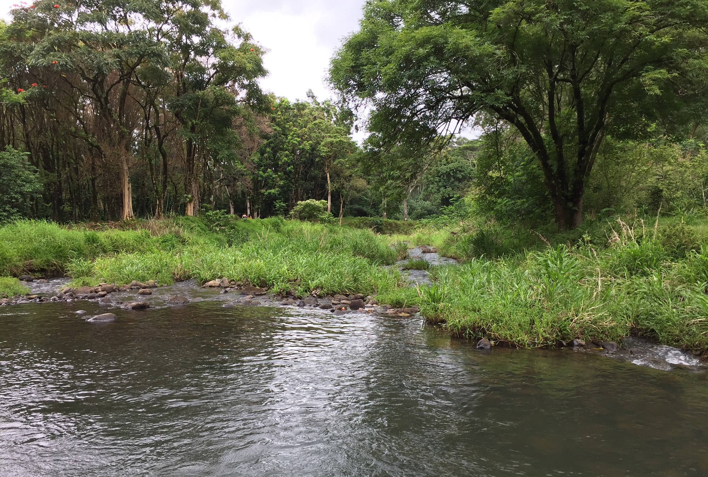

# Before You Start

You are inheriting a code base. You cannot start from scratch and build your own, because you will almost never get that opportunity on the job. You must read the current code with your teammates and try to understand what it is doing. Then you must refactor it - even if it means deleting some of the code that currently exists - to build the rest of the features.

The goal of this group project, likely more than any other one, is to *learn*. Focusing on productivity is something you will need to worry about on the job. Have fun with this code, make lots of mistakes, refactor them, and learn about what you can do with Python.

This will be a large challenge. How will you respond to it? Attack it with excitement, or withdraw from it in defeat? Time to see how far you have come with working on your Growth Mindset.

1. Everyone clone the repository
1. `cd` to the project directory
1. Run the command `pip install -r requirements.txt`
1. Run the command `python index.py` to start your application _(do not use AREPL for this project)_

## Guidelines

* You will not learn anything in this group project if you don't communicate well with each other.
* You will not get anything done if you don't communicate well with each other.
* Collaboration is key in this project. Working solo will get you nowhere.
* Showing up late, extended lunches, going home early and leaving your team stranded will get you pulled off the team.
* Create [pull request and issue ticket templates](https://help.github.com/en/articles/about-issue-and-pull-request-templates) for your team.

# Keahua Arboretum

You and your friends have decided to connect with the earth again and abandon your reliance on technology and urban vices. You have decided to move to Hawaii and join the land management team for the Keahua Arboretum.

You have met with other foresters and land managers and have decided on the animals and plants below to focus on growing and maintaining for the arboretum.

## Biomes

Listed below are the different biomes, or habitats, that exist in the arboretum and how many new plants and animals that can be introduced into it.

| | Mountain | Grassland | River | Forest | Swamp | Coastline |
|---|---|---|---|---|---|---|
| **Capacity** | 4 plants <br/> 6 animals | 15 plants <br/> 22 animals | 6 plants <br/> 12 animals | 32 plants <br/> 20 animals | 12 plants <br/> 8 animals | 3 plants <br/> 15 animals |
| **Characteristics** | High elevation | Little rainfall, <br /> No shade | Fresh water | Rainy, <br /> Shady | Stagnant fresh water | Saltwater

## Fauna

This is a list of animals that you and your teammates are in charge of raising, feeding _(when needed)_, releasing, and tracking. Animals should not be released into the wild before their recommended release age. Animals should not be fed anything other than their recommended prey.

| | [Pueo](http://www.instanthawaii.com/cgi-bin/hi?!2iETuMmX10OSniaHKbduRinuudfv1t0Mrdvkv221alreoCmOmrnSe4efF62ZRvgOubemm40br8)  | [River Dolphins](https://en.wikipedia.org/wiki/River_dolphin)  | ['Ulae](http://www.instanthawaii.com/cgi-bin/hi?!2iETuMmX10OSniaHKbduR2AnTffmIsOsdivBOjd8f0rhobinnrnarboL82Cbf3frNjaOmenqdlv8)  | [Gold Dust Day Gecko](http://www.instanthawaii.com/cgi-bin/hi?!6dnqdiekKe3ZrlAOTnaXOaONnnaaKb36r8AOuMe9m40N0djAF1C8foEenzrwnmds0boT86dlTvETuae4) | [Nene Goose](http://www.instanthawaii.com/cgi-bin/hi?!8lvkvA2ur5A6TMfz1e0qeoaaKj3Fr2nhn1eXImC0uijRF22lToE6ahmnQtCSeEeHv1bOT9ntn2) | [Kīkākapu](http://www.instanthawaii.com/cgi-bin/hi?!6dnqdiekKe3ZrlAOTnaXOr0anr7fv6dcT0ETuCm9QodaugeRO1bZR1g0ojmYOeCsdfvTOjdaT4) | [Ope'ape'a](https://www.opeapea.org) | [Hawaiian Happy-Face Spider](https://en.wikipedia.org/wiki/Theridion_grallator) |
|---|---|---|---|---|---|---|---|---|
| **Location** |  Grassland or Forest | River or Coastline | Coastline | Forest | Grassland | Swamp or River | Forest or Mountain | Swamp |
| **Prey/Food** | Rodents | Fish | Fish | Insects | Vegetation | Fish | Insects and Vegetation | Insects |
| **Minimum Release Age<br/>(in months)** | 8 | 13 | 1 | 2 | 7 | 1 | 5 | 0.5 |

## Flora

| | [Rainbow Eucalyptus Tree](https://www.worldfortravel.com/rainbow-eucalyptus-trees-maui-hawaii/) | [Silversword](http://www.instanthawaii.com/cgi-bin/hi?!2iETuaiz1oOqng7Tvj11r5ATTMf910OqniaHvAb1T9n0N1iaQrdN0fvROG17ferONzrmnt0arEvkv0b8) | [Mountain Apple Tree](http://www.instanthawaii.com/cgi-bin/hi?!2iETuaiz1oOqng7Tvj1ZrlAtuaaz1iOsdivBOjd8f0rhobinnrnarboL82Cbf3frNjaOmenqdlv8) | [Blue Jade Vine](http://www.instanthawaii.com/cgi-bin/hi?!2iETuaiz1oOqng7Tvj1lr1AhTCfQ1t0Mrdvkv221alreoCmOmrnSe4efF62ZRvgOubemm40br8) |
|---|---|---|---| --- |
|**Location**| Forest | Grassland | Mountain | Grassland or Swamp |
|**Sunlight**| Shade | Full | Partial | Partial |
|**Seeds Produced**| 8 | 22 | 17 | 0 |
|**Insecticide Resistance**| Low | High | High | Medium |

## Keahua Inventory and Land Lifeline Electronic Repository (KILLER)

Fancy web applications are so 2018. Command line applications provide a much more hands-on, personal, bespoke, artisinal experience when managing an arboretum like Keahua. Therefore, even though you are casting off your digital personas to lead a life connected with the land, you still want to use your hard-earned skills as developers to make management of the land as efficient as possible.

Here are the main features that the application must be able to perform.

### Main Menu

When the user first executes KILLER, they should be welcomed to the system and be presented with the following menu.

```sh
 +-++-++-++-++-++-++-++-++-++-++-++-++-++-++-++-++-+
 |  K  e  a  h  u  a    A  r  b  o  r  e  t  u  m  |
 +-++-++-++-++-++-++-++-++-++-++-++-++-++-++-++-++-+

1. Annex Biome
2. Release New Animal
3. Feed Animal
4. Cultivate New Plant
5. Show Arboretum Report
6. Exit

Choose a KILLER option.
> _
```

### Biome Annex Sub-Menu

If the user chooses option 1, then the following menu should be displayed

```sh
1. Mountain
2. Swamp
3. Grassland
4. Forest
5. River

Choose what you want to annex.
> _
```

When the user makes a choice, a new instance of that type of biome should be added to list on the arboretum object that contains those biomes.

### Animal Menu

If the user chooses 2 from the main menu, then she should see the following menu, with the animals listed.

```html
1. Gold Dust Day Gecko
2. River Dolphin
3. Nene Goose
4. Kīkākapu
5. Pueo
6. 'Ulae
7. Ope'ape'a
8. Happy-Face Spider

Choose animal.
> _
```

When the user enters in what to buy, then display all of the locations in which the animals can be stored. The current number of animals should be displayed for each location.

```sh
1. Mountain (2 animals)
2. Forest (4 animals)
2. Forest (0 animals)

Where would you like to place the animal?
> _
```

If the user chose to place them in a location that would be over capacity if they were placed there, display a message and show the menu again.

```html
****   That biome is not large enough   ****
****     Please choose another one      ****

1. Mountain (2 animals)
2. Forest (4 animals)
3. Forest (0 animals)

Where would you like to release the Ope'ape'a?
> _
```

### Animal Feeding Menu

If the user chooses 3 from the main menu, then she should see the following menu, with the plants listed.

```html
1. Gold Dust Day Gecko
2. River Dolphin
3. Nene Goose
4. Kīkākapu
5. Pueo
6. 'Ulae
7. Ope'ape'a
8. Happy-Face Spider

Choose animal to feed.
> _
```

When the user chooses an animal, another menu should appear showing the specific food that you have in stock to feed it.

```html
1. Trout
2. Mackarel
3. Salmon
4. Sardine

What is on the menu for the River Dolphin today?
> _
```

Once the user chooses a food item, she should be presented with a message.

```html
The river dolphin ate salmon for a meal.

Press any key to return to the main menu...
```

### Plant Cultivation Menu

If the user chooses 4 from the main menu, then she should see the following menu, with the plants listed.

```html
1. Mountain Apple Tree
2. Silversword
3. Rainbow Eucalyptus Tree
4. Blue Jade Vine

Choose plant to cultivate.
> _
```

When the user makes a choice, then display all of the locations in which the plants can be planted. The current number of plant rows should be displayed for each location.

```sh
1. Grassland (5 plants)
2. Swamp (2 plants)
3. Swamp (9 plants)
4. Swamp (0 plants)

Where would you like to plant the Sun Jade Vine?
> _
```

If the user chose to place them in a location that would be over capacity if they were placed there, display a message and show the menu again.

```html
****   That biome is not large enough   ****
****     Please choose another one      ****

1. Grassland (5 plants)
2. Swamp (2 plants)
3. Swamp (9 plants)
4. Swamp (0 plants)

Where would you like to plant the Sun Jade Vine?
> _
```

### Arboretum Report Menu

Choosing this option will list all existing biomes, and then list all animals and plants in that biome. Only display the first 8 characters of the id in the report.

```html
River [157b2efe]
    River Dolphin (133619c4)

Mountain [bdf33960]
    Ope'ape'a (bf9ad976)
    Ope'ape'a (f9dd0afa)
    Mountain Apple Tree (h91d77a0)


Press any key to continue...
```

## Stretch Goals

1. Display groups of things in each biome when you display the lists above.
    ```html
    1. Grassland (1 Silversword, 4 Blue Jade Vine, 4 Nene Goose)
    ```
2. Only show biomes that are able to store the number of animals/plants. For example, the user chooses to release a river dolphin and one of the river biomes is already at capacity.
    ```sh
    1. Mountain (5 plants)
    2. River (12 animals)  <-- not a valid choice
    3. Grassland (0 plants)
    ```

     Instead of showing all possible options, only show valid options.

    ```sh
    1. Mountain (5 plants)
    2. Grassland (0 plants)
    ```


## Arboretum Class

A helpful hint to get you started. You need a **`Arboretum`** class. This class will contain lists for each kind of biomes that you want to assign animals or plants to.

```py
class Arboretum:

    def __init__(self):
        self.__rivers = []

    @property
    def rivers(self):
        return self.__rivers

    def annex_river(self, river):
        self.__rivers.append(river)
```
